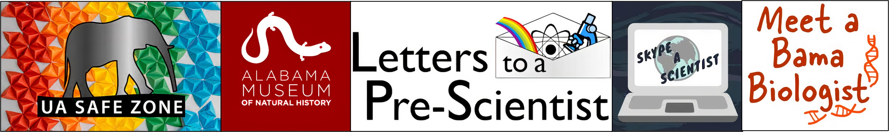

::: {layout-ncol="1"}
{fig-align="center" width="100%"}
:::

+----------------------------------------------------------------------------------------------------------------------+-------------------------+
| [**Clear Direction Mentoring**](https://cleardirectionmentoring.org/)                                                | Fall 2023 - Present     |
|                                                                                                                      |                         |
| *Mentor*                                                                                                             |                         |
+----------------------------------------------------------------------------------------------------------------------+-------------------------+
| [**Denver Metro Regional Science & Engineering Fair**](https://clas.ucdenver.edu/denversciencefair/)                 | Spring 2022             |
|                                                                                                                      |                         |
| *Volunteer Judge*                                                                                                    |                         |
+----------------------------------------------------------------------------------------------------------------------+-------------------------+
| [**Meet a Bama Biologist**](https://rlearley.people.ua.edu/meetabamabiologist.html)                                  | Spring 2021 - Present   |
|                                                                                                                      |                         |
| *Scientific Volunteer*                                                                                               |                         |
+----------------------------------------------------------------------------------------------------------------------+-------------------------+
| [**University of Alabama Undergraduate Research & Creative Activity Conference**](https://research.ua.edu/our/urca/) | Spring 2021 & 2022      |
|                                                                                                                      |                         |
| *Volunteer Judge*                                                                                                    |                         |
+----------------------------------------------------------------------------------------------------------------------+-------------------------+
| [**University of Alabama STEM Showcase**](https://ccbp.ua.edu/stem-showcase/)                                        | Spring 2021             |
|                                                                                                                      |                         |
| *Volunteer Judge*                                                                                                    |                         |
+----------------------------------------------------------------------------------------------------------------------+-------------------------+
| [**Letters to a Pre-Scientist**](https://prescientist.org/)                                                          | Fall 2020 - Present     |
|                                                                                                                      |                         |
| *Scientific Volunteer*                                                                                               |                         |
+----------------------------------------------------------------------------------------------------------------------+-------------------------+
| [**UA SafeZone**](https://diversity.ua.edu/safe-zone/)                                                               | Fall 2019 - Spring 2023 |
|                                                                                                                      |                         |
| *Ally/Trainer*                                                                                                       |                         |
+----------------------------------------------------------------------------------------------------------------------+-------------------------+
| [**The University of Alabama's Night at the Museum**](https://almnh.museums.ua.edu/event/night-at-the-museum/)       | Spring 2019             |
|                                                                                                                      |                         |
| *Volunteer Biology Instructor*                                                                                       |                         |
+----------------------------------------------------------------------------------------------------------------------+-------------------------+
| [**Skype a Scientist**](https://www.skypeascientist.com/)                                                            | Spring 2018 - Present   |
|                                                                                                                      |                         |
| *Scientific Volunteer*                                                                                               |                         |
+----------------------------------------------------------------------------------------------------------------------+-------------------------+
